# SunSign Model Vocabulary

Here is the complete list of vocabulary that your SunSign application currently knows natively, along with visual examples straight from your dataset!

> [!TIP]
> **How to Test**
> Open the app and form the shape of a static letter (e.g., "ب"). The UI will begin a 1.5-second loading ring. Before the ring completes, perform a dynamic motion from the LSTM list (like the sign for "eat"). The system will cancel the letter and immediately write "eat" to your sentence!

## 1. Static Arabic Letters (CNN Model)

These are recognized from a single static frame of the hand. Hold the shape in front of the camera for 1.5 seconds to commit the letter to the text box.

| Arabic | English | Demo |
|--------|---------|------|
| أ | aleff | 
 aleff
 |
| ب | bb | 
 bb
 |
| ت | taa | 
 taa
 |
| ث | thaa | 
 thaa
 |
| ج | jeem | 
 jeem
 |
| ح | haa | 
 haa
 |
| خ | khaa | 
 khaa
 |
| د | dal | 
 dal
 |
| ذ | thal | 
 thal
 |
| ر | ra | 
 ra
 |
| ز | zay | 
 zay
 |
| س | seen | 
 seen
 |
| ش | sheen | 
 sheen
 |
| ص | saad | 
 saad
 |
| ض | dhad | 
 dhad
 |
| ط | ta | 
 ta
 |
| ظ | dha | 
 dha
 |
| ع | ain | 
 ain
 |
| غ | ghain | 
 ghain
 |
| ف | fa | 
 fa
 |
| ق | gaaf | 
 gaaf
 |
| ك | kaaf | 
 kaaf
 |
| ل | laam | 
 laam
 |
| م | meem | 
 meem
 |
| ن | nun | 
 nun
 |
| ه | ha | 
 ha
 |
| و | waw | 
 waw
 |
| ي | ya | 
 ya
 |
| ى | yaa | 
 yaa
 |
| ة | toot | 
 toot
 |
| ال | al | 
 al
 |
| لا | la | 
 la
 |

## 2. Dynamic Words & Phrases (LSTM Model)

These require a sequence of motions (about 1 second / 30 frames) to be recognized. Feel free to interact with the demo.

| Arabic | English | Demo |
|--------|---------|------|
| ٠ | number_0 | 
 number_0
 |
| ١ | number_1 | 
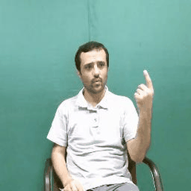 number_1
 |
| ١٬٠٠٠٬٠٠٠ | number_1000000 | 
 number_1000000
 |
| ١٠ | number_10 | 
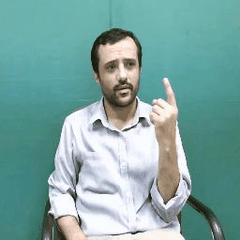 number_10
 |
| ١٠٬٠٠٠٬٠٠٠ | number_10000000 | 
 number_10000000
 |
| ١٠٠ | number_100 | 
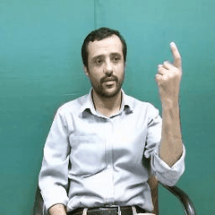 number_100
 |
| ١٠٠٠ | number_1000 | 
 number_1000
 |
| ٢ | number_2 | 
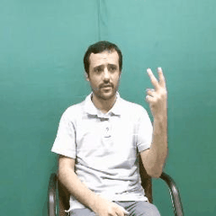 number_2
 |
| ٢٠ | number_20 | 
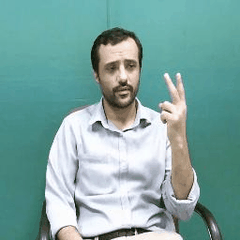 number_20
 |
| ٢٠٠ | number_200 | 
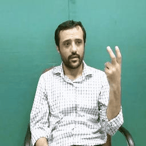 number_200
 |
| ٣ | number_3 | 
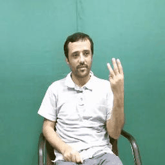 number_3
 |
| ٣٠ | number_30 | 
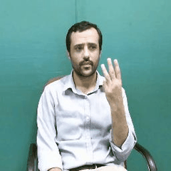 number_30
 |
| ٣٠٠ | number_300 | 
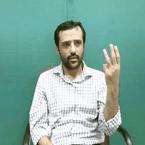 number_300
 |
| ٤ | number_4 | 
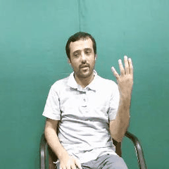 number_4
 |
| ٤٠ | number_40 | 
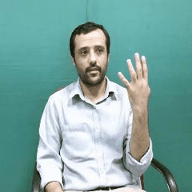 number_40
 |
| ٤٠٠ | number_400 | 
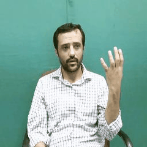 number_400
 |
| ٥ | number_5 | 
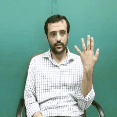 number_5
 |
| ٥٠ | number_50 | 
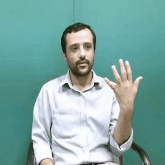 number_50
 |
| ٥٠٠ | number_500 | 
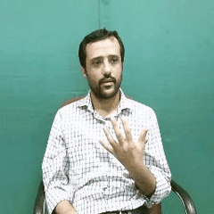 number_500
 |
| ٦ | number_6 | 
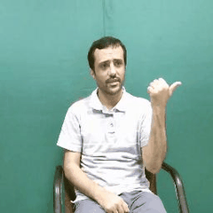 number_6
 |
| ٦٠ | number_60 | 
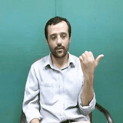 number_60
 |
| ٦٠٠ | number_600 | 
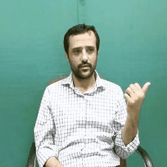 number_600
 |
| ٧ | number_7 | 
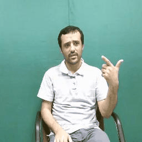 number_7
 |
| ٧٠ | number_70 | 
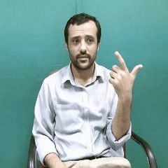 number_70
 |
| ٧٠٠ | number_700 | 
 number_700
 |
| ٨ | number_8 | 
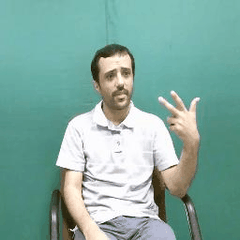 number_8
 |
| ٨٠ | number_80 | 
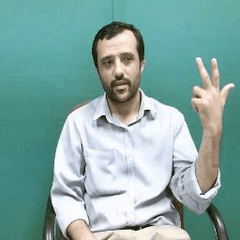 number_80
 |
| ٨٠٠ | number_800 | 
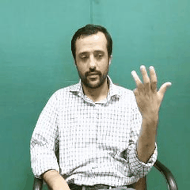 number_800
 |
| ٩ | number_9 | 
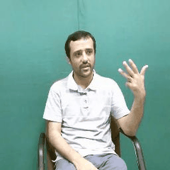 number_9
 |
| ٩٠ | number_90 | 
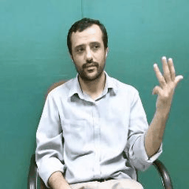 number_90
 |
| ٩٠٠ | number_900 | 
 number_900
 |
| ء | hamza | 
 hamza
 |
| أ | alif with hamza above | 
 alif with hamza above
 |
| ؤ | Waaw with hamza | 
 Waaw with hamza
 |
| إ | alif with hamza below | 
 alif with hamza below
 |
| ئ | Alif maqsoura with hamza | 
 Alif maqsoura with hamza
 |
| ئـ | hamza on line | 
 hamza on line
 |
| ا | alif | 
 alif
 |
| آ | ALif with maad | 
 ALif with maad
 |
| آسف | Sorry | 
 Sorry
 |
| أب | father | 
 father
 |
| أخذ إبرة | acupuncture | 
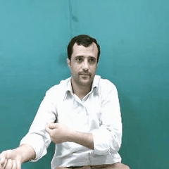 acupuncture
 |
| إدمان | addiction | 
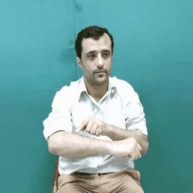 addiction
 |
| أزمة قلبية | heart attack | 
 heart attack
 |
| إسعافات أولية | first aid | 
 first aid
 |
| إسهال | diarrhea | 
 diarrhea
 |
| أشعة ليزر | laser ray | 
 laser ray
 |
| إعاقة | hindrance | 
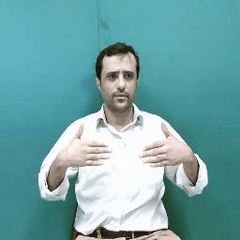 hindrance
 |
| اعاقة بصرية | visual impairment | 
 visual impairment
 |
| اعاقة جسدية | physical disability | 
 physical disability
 |
| إعاقة ذهنية | mentality hindrance | 
 mentality hindrance
 |
| إعاقة سمعية | hearing hindrance | 
 hearing hindrance
 |
| ال | Al | 
 Al
 |
| الأمعاء الدقيقة | Small intestine | 
 Small intestine
 |
| الأمعاء الغليظة | Large intestine | 
 Large intestine
 |
| البنكرياس | pancreas | 
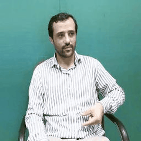 pancreas
 |
| التهاب | inflammation | 
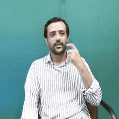 inflammation
 |
| الحمد لله | Alhamdulillah | 
 Alhamdulillah
 |
| الزائدة الدودية | Appendix | 
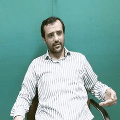 Appendix
 |
| السلام عليكم | Salam aleikum | 
 Salam aleikum
 |
| ألم | pain | 
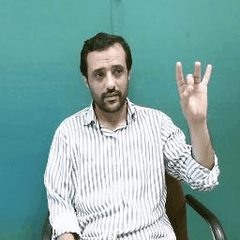 pain
 |
| أم | mother | 
 mother
 |
| إمساك | constipation | 
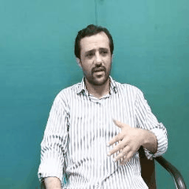 constipation
 |
| أنا | me | 
 me
 |
| أنا آسف | I am sorry | 
 I am sorry
 |
| أنا بخير | I am fine | 
 I am fine
 |
| إنتشار | spread | 
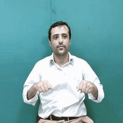 spread
 |
| انتهى | finish | 
 finish
 |
| أنسجة | tissue | 
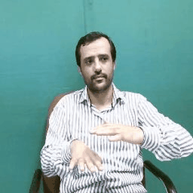 tissue
 |
| ب | baa | 
 baa
 |
| بكتريا | bacterium | 
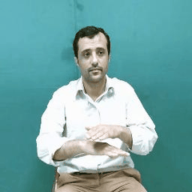 bacterium
 |
| بلعوم | pharynx | 
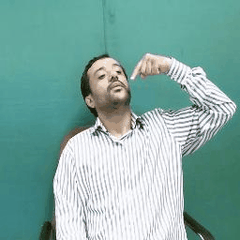 pharynx
 |
| بيت | house | 
 house
 |
| ة | taa marbuuTa | 
 taa marbuuTa
 |
| تحليل دم | blood analysis | 
 blood analysis
 |
| تحليل طبي | analysis | 
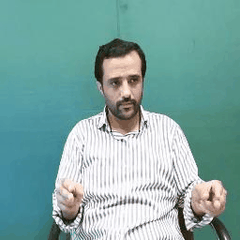 analysis
 |
| تساقط الشعر | Loss of hair | 
 Loss of hair
 |
| تطعيم | inoculation | 
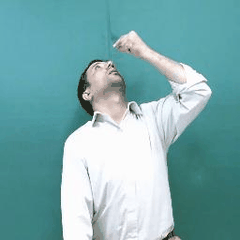 inoculation
 |
| تفكير | thinking | 
 thinking
 |
| تلقيح | pollination | 
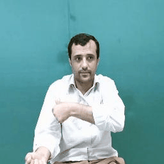 pollination
 |
| توحد / أوتيزم | oneness | 
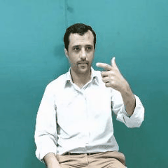 oneness
 |
| تورم | swelling | 
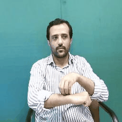 swelling
 |
| ث | tha | 
 tha
 |
| ج | Jiim | 
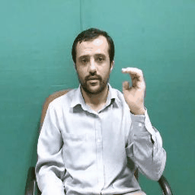 Jiim
 |
| جرثومة | microbe | 
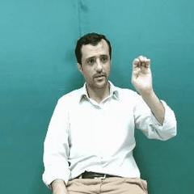 microbe
 |
| جرح نازف | wound | 
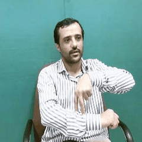 wound
 |
| جمجة | skull | 
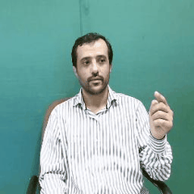 skull
 |
| جهاز تنفسي | Respiratory device | 
 Respiratory device
 |
| جهاز عصبي | nervous system | 
 nervous system
 |
| جهاز قياس الضغط | sphygmometroscope | 
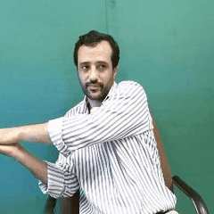 sphygmometroscope
 |
| جهاز هضمي | digestive system | 
 digestive system
 |
| جيد | good | 
 good
 |
| ح | Haa | 
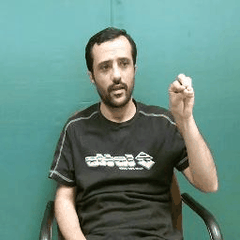 Haa
 |
| حروق | burning | 
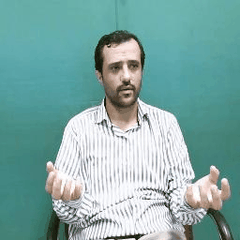 burning
 |
| حزين | sad | 
 sad
 |
| حساسية | allergy | 
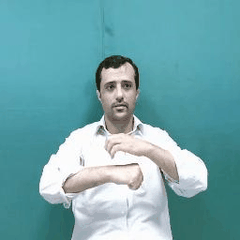 allergy
 |
| حكة / هرش | itch | 
 itch
 |
| حمى | fever | 
 fever
 |
| حواس خمس | five senses | 
 five senses
 |
| خ | kha | 
 kha
 |
| د | daal | 
 daal
 |
| دواء | medicine | 
 medicine
 |
| دواء شراب | liquid medicine | 
 liquid medicine
 |
| دورة شهرية | monthly circulation | 
 monthly circulation
 |
| ر | raa | 
 raa
 |
| رئتان | lungs | 
 lungs
 |
| زكام | cold | 
 cold
 |
| س | siin | 
 siin
 |
| سرطان | cancer | 
 cancer
 |
| سعيد | happy | 
 happy
 |
| سكتة قلبية | Heart failure | 
 Heart failure
 |
| سماعة أذن | stethoscope | 
 stethoscope
 |
| ش | shiin | 
 shiin
 |
| شاش / ضمادة | gauze | 
 gauze
 |
| شريط لاصق / بلاستر | adhesive tape | 
 adhesive tape
 |
| شكراً | Thanks | 
 Thanks
 |
| شكراً | thanks | 
 thanks
 |
| شلل دماغي | Cerebral paralysis | 
 Cerebral paralysis
 |
| شلل نصفي | hemiplegia | 
 hemiplegia
 |
| شهيق - زفير | Ins and Outs | 
 Ins and Outs
 |
| ص | Saad | 
 Saad
 |
| صباح الخير | Good morning | 
 Good morning
 |
| صداع | headache | 
 headache
 |
| صورة اشعة | ray photo | 
 ray photo
 |
| صيدلية | pharmacy | 
 pharmacy
 |
| ض | Daad | 
 Daad
 |
| ضغط الدم | blood pressure | 
 blood pressure
 |
| ط | Taa | 
 Taa
 |
| طفل | baby | 
 baby
 |
| ظ | Zaa | 
 Zaa
 |
| ع | Ayn | 
 Ayn
 |
| عادي | normal | 
 normal
 |
| عدوى | infection | 
 infection
 |
| عصب | nerve | 
 nerve
 |
| عضلة | muscle | 
 muscle
 |
| عملية جراحية | surgery | 
 surgery
 |
| عمود فقري | Backbone | 
 Backbone
 |
| غ | ghayn | 
 ghayn
 |
| ف | faa | 
 faa
 |
| فحص النظر | sight examination | 
 sight examination
 |
| فحص سريري | physical examination | 
 physical examination
 |
| فيروس | virus | 
 virus
 |
| ق | qaaf | 
 qaaf
 |
| قصبة هوائية | Trachea | 
 Trachea
 |
| قطارة | dropper | 
 dropper
 |
| قف | stop | 
 stop
 |
| قفص صدري | Chest | 
 Chest
 |
| قلب | heart | 
 heart
 |
| قلق | worry | 
 worry
 |
| كبد | liver | 
 liver
 |
| كبسولة | capsule | 
 capsule
 |
| كيف حالك؟ | How are you | 
 How are you
 |
| لا | laam Alif | 
 laam Alif
 |
| ليس سيئاً | Not bad | 
 Not bad
 |
| م | miim | 
 miim
 |
| مخدر/ بنج | anesthetist | 
 anesthetist
 |
| مخدرات | drug's | 
 drug's
 |
| مرض السكر / سكري | diabetes | 
 diabetes
 |
| مرض فقدان المناعة / الإيدز | Aids | 
 Aids
 |
| مرهم | ointment | 
 ointment
 |
| مريض / مرض | sick | 
 sick
 |
| مساء الخير | Good evening | 
 Good evening
 |
| مستشفى | hospital | 
 hospital
 |
| مسجد | mosque | 
 mosque
 |
| مع السلامة | Good bye | 
 Good bye
 |
| معافى | healthy | 
 healthy
 |
| معمل التحاليل / مختبر | analysis laboratory | 
 analysis laboratory
 |
| مغص | colic | 
 colic
 |
| مناعة | immunity | 
 immunity
 |
| منغولي | mongoloid | 
 mongoloid
 |
| مهم | important | 
 important
 |
| مول | mall | 
 mall
 |
| ميزان حرارة | thermometer | 
 thermometer
 |
| ن | noon | 
 noon
 |
| نبض القلب | pulse | 
 pulse
 |
| هيكل عظمي | Skeleton | 
 Skeleton
 |
| و | waaw | 
 waaw
 |
| وباء | epidemic | 
 epidemic
 |
| وجه | Face | 
 Face
 |
| ى | Alif maqsoura | 
 Alif maqsoura
 |
| يأكل | eat | 
 eat
 |
| يبني | build | 
 build
 |
| يتنامى | grow | 
 grow
 |
| يحب | love | 
 love
 |
| يحرث | plow | 
 plow
 |
| يحصد | harvest | 
 harvest
 |
| يختار | choose | 
 choose
 |
| يدخن | smoke | 
 smoke
 |
| يدعم | support | 
 support
 |
| يزرع | plant | 
 plant
 |
| يساعد | help | 
 help
 |
| يستحم | bathe | 
 bathe
 |
| يستيقظ | wake up | 
 wake up
 |
| يسعدني لقاءك | I am pleased to meet you | 
 I am pleased to meet you
 |
| يسقي | irrigate | 
 irrigate
 |
| يسكت | silence | 
 silence
 |
| يسمع | hear | 
 hear
 |
| يشرب | drink | 
 drink
 |
| يشم | inhale | 
 inhale
 |
| يشوي | grill | 
 grill
 |
| يصبغ | dye | 
 dye
 |
| يصعد | rise | 
 rise
 |
| يفتح | open | 
 open
 |
| يفكر | think | 
 think
 |
| يقف | stand | 
 stand
 |
| يقفل ( يغلق ) | close | 
 close
 |
| يكره | hate | 
 hate
 |
| يكسر | break | 
 break
 |
| يمشي | walk | 
 walk
 |
| ينادي | call | 
 call
 |
| ينام | sleep | 
 sleep
 |
| ينزل | descend | 
 descend
 |
