# SunSign Model Vocabulary

Here is the complete list of vocabulary that your SunSign application currently knows natively, along with visual examples straight from your dataset!

## 1. Dynamic Words & Phrases (LSTM Model)

These require a sequence of motions (about 1 second / 30 frames) to be recognized. Feel free to interact with the demo.

| Phrase / Word | Type | Demo |
|---------------|------|------|
| Alhamdulillah | Word/Action |  |
| baby | Word/Action | 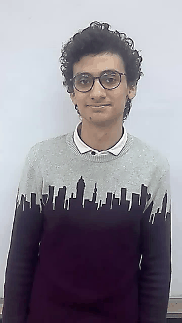 |
| eat | Word/Action | 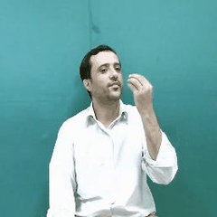 |
| father | Word/Action | 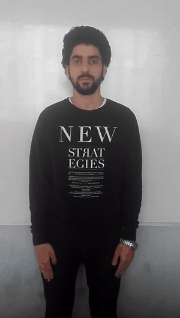 |
| finish | Word/Action | 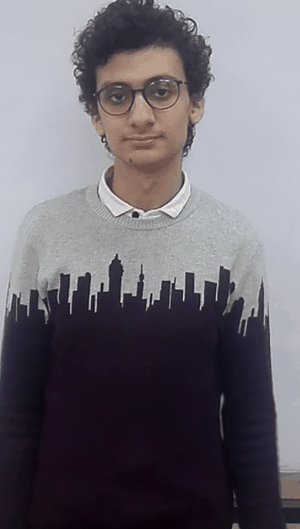 |
| good | Word/Action | 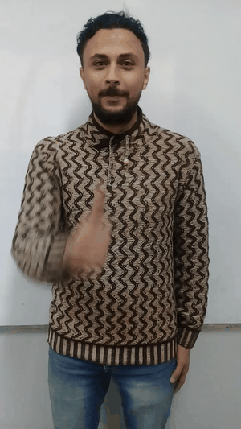 |
| Good bye | Word/Action | 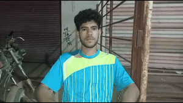 |
| Good evening | Word/Action | 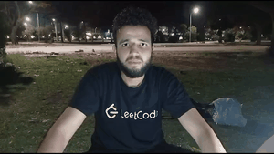 |
| Good morning | Word/Action | 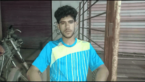 |
| haa | Word/Action |  |
| happy | Word/Action | 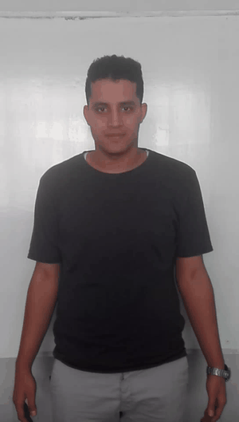 |
| hear | Word/Action | 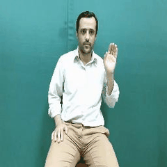 |
| house | Word/Action | 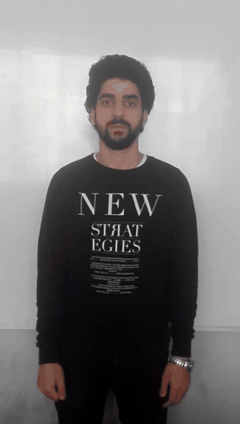 |
| How are you | Word/Action | 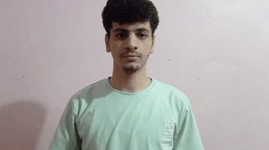 |
| I am fine | Word/Action | 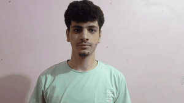 |
| I am pleased to meet you | Word/Action | 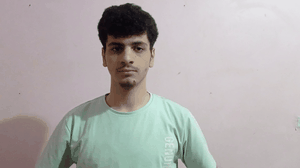 |
| I am sorry | Word/Action | 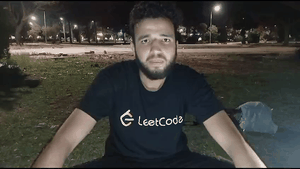 |
| important | Word/Action | 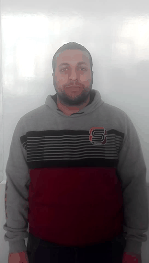 |
| kaaf | Word/Action |  |
| laam | Word/Action |  |
| love | Word/Action | 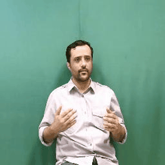 |
| mall | Word/Action | 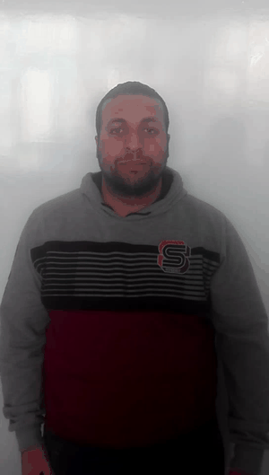 |
| me | Word/Action | 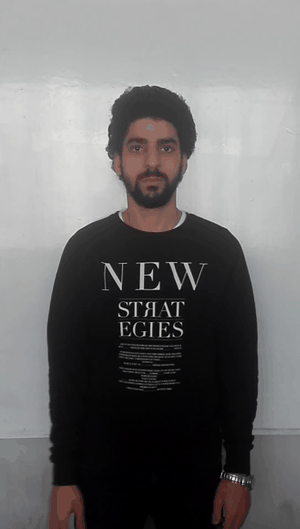 |
| mosque | Word/Action | 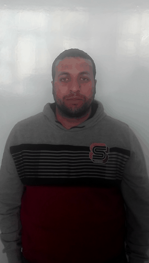 |
| mother | Word/Action |  |
| normal | Word/Action | 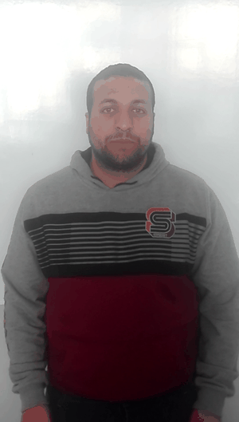 |
| Not bad | Word/Action | 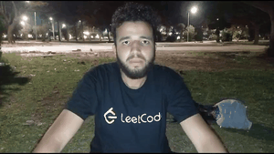 |
| sad | Word/Action | 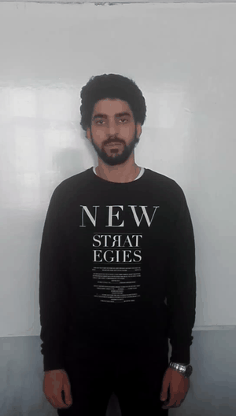 |
| Salam aleikum | Word/Action | 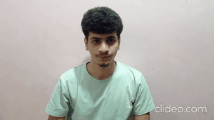 |
| Sorry | Word/Action | 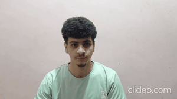 |
| stop | Word/Action | 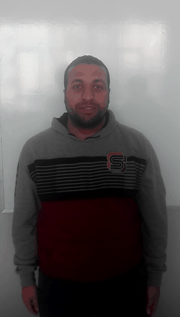 |
| ta | Word/Action | 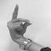 |
| thal | Word/Action | 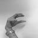 |
| thanks | Word/Action |  |
| Thanks | Word/Action | 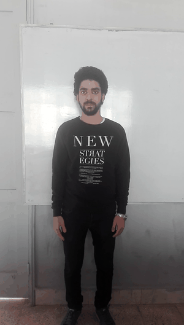 |
| thinking | Word/Action |  |
| worry | Word/Action |  |
| yaa | Word/Action |  |
| zay | Word/Action |  |

*Note: The system supports additional words (218 total) that currently lack visual demo materials in this document.*

## 2. Static Arabic Letters (CNN Model)

These are recognized from a single static frame of the hand. Hold the shape in front of the camera for 1.5 seconds to commit the letter to the text box.

| Arabic Letter | Transliteration (Name) | Demo |
|---------------|------------------------|------|
| أ | aleff |  |
| ب | bb |  |
| ت | taa |  |
| ث | thaa |  |
| ج | jeem |  |
| ح | haa |  |
| خ | khaa | 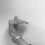 |
| د | dal |  |
| ذ | thal |  |
| ر | ra | 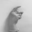 |
| ز | zay |  |
| س | seen |  |
| ش | sheen |  |
| ص | saad |  |
| ض | dhad |  |
| ط | ta |  |
| ظ | dha |  |
| ع | ain |  |
| غ | ghain |  |
| ف | fa |  |
| ق | gaaf |  |
| ك | kaaf |  |
| ل | laam |  |
| م | meem |  |
| ن | nun |  |
| ه | ha |  |
| و | waw |  |
| ي | ya |  |
| ى | yaa |  |
| ة | toot |  |
| ال | al |  |
| لا | la |  |

> [!TIP]
> **How to Test**
> Open the app and form the shape of a static letter (e.g., "ب"). The UI will begin a 1.5-second loading ring. Before the ring completes, perform a dynamic motion from the LSTM list (like the sign for "eat"). The system will cancel the letter and immediately write "eat" to your sentence!
